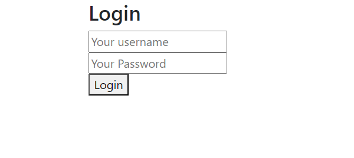

# functional-videos
Video hosting project made with microservice architecture

## Introduction
Upload and watch videos with autoscaling and redundancy. Made using P and docker to be hosted using Kubernetes.

## Services
- database: stores the metadata for videos
- filesystem: stores and hosts videos
- upload: uploads videos to database and filesystem
- app: view and search for videos
- auth: very basic authentication

## Getting started 
### Prerequisites
- [Docker](https://docs.docker.com/desktop/install/windows-install/), as well as Docker Compose (this comes with Docker desktop)
- [Python](https://www.python.org/downloads/)

### Start Project

Development with Docker-compose:

Due to how Docker does internal networking on containers sharing a virtual network, some additional changes must be made.
1. Define and set variables listed in env.example
1. Add `ENV FLASK_RUN_PORT="PORT_NUMBER_DEFINED_IN_ENV"` to the `Dockerfile` of each service before building
2. Run `docker compose up`, use the `--build` the first time after doing step 1
3. Upload should be visible at [http://localhost:5000](http://localhost:5000) and viewer should be visible at [http://localhost:5003](http://localhost:5003) 
4. Login using credentials in `users.json`

Hosting with Kubernetes:

This should work out of the box
1. Define and set variables listed in env.example
2. Run `docker compose build` 
3. Upload images to container storage of choice; one option is [docker image push](https://docs.docker.com/engine/reference/commandline/push/)
4. This works as any Kubernetes project; use `kubectl apply -f ./path/ending/with/the/directory/kube`. If this is hosted in the cloud, only the contents of the kube directory are needed, as the images should be hosted somewhere
5. The upload should be visible at IP_HOSTED_AT:5000. The viewer should be visible at IP_HOSTED_AT:5009

## Using the project
### Uploading
1. The upload URL will take you to the login page:

2. After logging in, you should see:

From there, upload a video with a title. The upload will fail if there is no title or if the file type is not MP4
3. Click the `Video` link to watch the video or use the viewer

### Viewing
1. Go to the Viewer URL; it will take you to the search page:

2. Once you find the video you want, login and watch it!

The video viewer is the one built into your brower; why reinvent the wheel?

## Troubleshooting
- If services are throwing errors when trying to make calls to "http://{environ['service_HOSTNAME'] }:{environ['service_PORT'] }/something" chances are the port does not match the internal docker port. Rebuild images after defining `ENV FLASK_RUN_PORT="PORT_NUMBER_DEFINED_IN_ENV` in the Dockerfile of the service that cannot be called. Make it match the `service_PORT`
- Database will not start because port 3306 is in use. Chances are you have a database running on your computer; if it is not important stop it. If this is in Kubernetes just make the exposed port something else and have it pipe to 3306 inside the container.

# Other Contributers
[UnknownTy](https://github.com/UnknownTy) made this with me.
